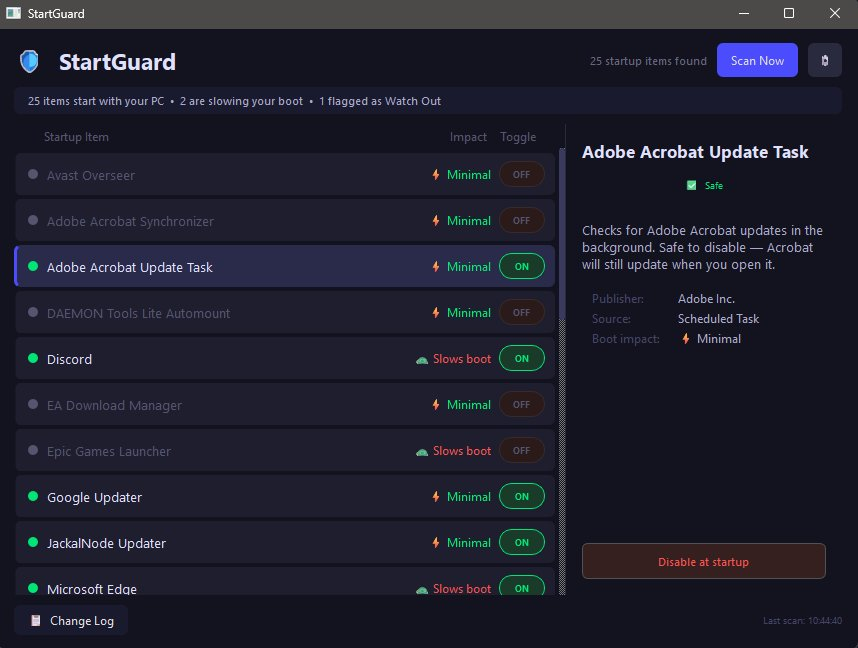

  

<h1 align="center">StartGuard</h1>

  <b>See what's slowing down your PC's startup — and take control, in plain English.</b>

  
  
  

---

## What is StartGuard?

Every time your PC turns on, a bunch of programs quietly start running in the background — and most people have no idea what half of them even are. Some of them are slowing your boot time down for no good reason.

StartGuard shows you exactly what's starting with your PC, explains what each item actually is in plain English (no tech jargon), and lets you safely turn off the ones you don't need — without breaking anything important.

It's free. No ads, no upsells, no account required. Just download it and use it.

## ⬇️ Download

**[Download the latest version here](https://github.com/JackalNode/StartGuard/releases/latest)**

Look for the `.exe` installer under **Assets**, download it, and run it. That's it.

> Requires Windows 10 or 11 (64-bit).

## ✨ Features

- **Plain-English explanations** — every startup item is explained in normal language, not tech speak
- **Safety ratings** — items are marked ✅ Safe, ⚠️ Unknown, or 🔴 Watch Out, so you know what's safe to touch
- **One-click toggle** — turn startup items on or off instantly, and turn them back on any time
- **Boot impact** — see which items are actually slowing your PC down the most
- **Self re-enabling detection** — get flagged if something sneakily turns itself back on after you disabled it
- **Dead link detection** — spots broken shortcuts pointing to files that no longer exist
- **Report unknown items** — help improve StartGuard for everyone by reporting anything it doesn't recognise yet
- **Automatic updates** — StartGuard checks for new versions on its own and lets you know when one's available
- **Your protection, never touched** — StartGuard will never let you disable Windows-critical or antivirus startup items

## 🖼️ Screenshots

  

<i>StartGuard showing a full startup scan, with safety ratings and detailed info for each item.</i>

## 🔒 Privacy & Safety

StartGuard runs entirely on your PC. It doesn't collect personal data, doesn't track you, and doesn't send anything anywhere — except when you choose to tap **Report this item**, which sends only the item's technical name to help expand StartGuard's database for everyone.

## 💬 Found a bug or have a suggestion?

Open an [issue on GitHub](https://github.com/JackalNode/StartGuard/issues), or use the **Report this item** button inside the app for unknown startup items specifically.

## ❤️ Support the project

StartGuard is free, full-featured, and always will be. If you'd like to support development, donations are welcome but never required — there's nothing locked behind a paywall, ever.

## 📄 Licence

StartGuard is free for personal use and for small businesses. See [LICENSE.txt](LICENSE.txt) for full details.

---

  Made by <a href="https://github.com/JackalNode">JackalNode</a> — putting control back in your hands.

